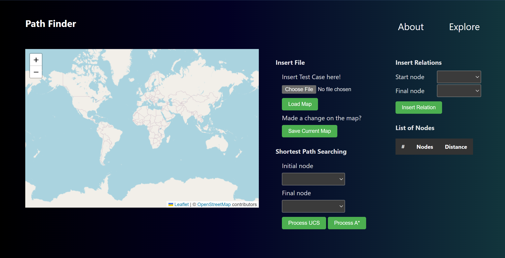

# Shortest Path Problem Solver using UCS and A* Algorithm
> *Source Code* ini dibuat untuk memenuhi Tugas Kecil 3 Strategi Algoritma yaitu mengimplementasikan
> Algoritma UCS dan A* untuk Menentukan Lintasan Terpendek

## Daftar Isi
- [Author](#author)
- [Deskripsi Singkat](#deskripsi-singkat)
- [Sistematika File](#sistematika-file)
- [Requirements](#requirements)
- [Cara Mengkompilasi dan Menjalankan Program](#cara-mengkompilasi-dan-menjalankan-program)
- [Format Masukan](#format-masukan)
- [Cara Mengoperasikan Program](#cara-mengoperasikan-program)
- [Daftar Fitur](#daftar-fitur)
- [Project Status](#project-status)
- [Screenshots](#screenshots)

## Author
| NIM      | Nama                        | Github Profile                            |
| -------- | ----------------------------|-------------------------------------------|
| 13521070 | Akmal Mahardika Nurwahyu P. | [akmaldika](https://github.com/akmaldika) |
| 13521108 | Michael Leon Putra Widhi    | [mikeleo03](https://github.com/mikeleo03) |

## Deskripsi Singkat
Pada Tugas Kecil kali ini, diimplementasikan sebuah program pencari jalur terpendek antara dua buah simpul pada peta menggunakan Algoritma *Uniform Cost Search* (UCS) dan Algoritma A*. Program akan menerima masukan berupa matriks ketetanggaan yang menyatakan nilai bobot yang menghubungkan dua buah simpul terkait untuk kemudian diterapkan kedua algoritma diatas dan dibandingkan hasilnya. Pencarian jalur terpendek menggunakan algoritma A* akan memiliki hasil yang sama dengan pencarian jalur terpendek menggunakan algoritma UCS jika diterapkan metode heuristik yang dapat diterima (*admissible*), oleh sebab itu, pada pogram yang dibuat, digunakan sebuah metode heuristik yaitu jarak garis lurus (*straight-line distance*) antara dua buah simpul awal dan tujuan.

## Sistematika File
```bash
.
├─── doc
├─── src
│   ├─── modules
│   │   ├─── Algorithm.js
│   │   ├─── Path.js
│   │   └─── PrioQueue.js
│   ├─── .gitignore
│   ├─── index.html
│   ├─── main.js
│   ├─── package-lock.json
│   ├─── package.json    
│   └─── style.css
├─── test
└─── README.md
```

## Requirements
- Leaflet.js v.1.9.3
- node.js (Pembuat menggunakan v.18.12.1)
- npm (Pembuat menggunakan v.8.19.2)

## Cara Mengkompilasi dan Menjalankan Program
Program yang diimplementasikan merupakan sebuah *website* yang telah dilakukan *deployment* pada tautan berikut
```bash
>>> shortestpath-finder.netlify.app
```
Akan tetapi program tetap dapat dikompilasi dan dijalankan dengan prosedur sebagai berikut
1. Lakukan *clone repository* melalui terminal dengan *command* berikut
   ``` bash
    $ git clone https://github.com/mikeleo03/Tucil3_13521070_13521108.git
   ```
2. Lakukan pemindahan direktori ke `src` dengan *command* berikut
   ``` bash
    $ cd src
   ```
3. Lakukan kompilasi dan unduh beberapa modul yang diperlukan dengan menjalankan *command* berikut
   ``` bash
    $ npm install
    $ npm run dev
   ```
4. Jika kompilasi berhasil, maka akan muncul sebuah tautan pada terminal. Bukalah tautan tersebut dan Anda akan langsung dihadapkan pada laman utama *website* yang telah dibuat.

## Format Masukan
Masukan yang diterima adalah masukan dengan ekstensi .json Berikut adalah contoh format data masukan yang diterima oleh program
```bash
{  "posList":[
   {"id":"1","nama":"simpul1","lintang":-6.893212002931665,"bujur":107.61044561862947},
   {"id":"2","nama":"simpul2","lintang":-6.893812697949787,"bujur":107.61305809020998},
   {"id":"3","nama":"simpul3","lintang":-6.893803136408218,"bujur":107.60839104652405}],
   
   "adjMatrix":[
   [0,0.299,0.224],
   [0.299,0,-1],
   [0.224,-1,0]]
}
```
File yang menjadi masukan kasus uji harus terdiri atas dua buah komponen utama, yaitu :
1. posList, merupakan sebuah larik berisi himpunan informasi terkait simpul masukan yang akan memudahkan proses penggambaran dan penjelasan pada peta. Himpunan informasi tersebut terdiri atas hal berikut (tekan tombol segitiga di bagian kiri setiap atribut informasi untuk melihat detil masukan).
   <details>
      <summary> id</summary>
      <p>Sebuah string numerik yang merupakan identifikator dari titik masukan.</p>
   </details>
   <details>
      <summary> nama</summary>
      <p>Sebuah string yang menyatakan nama simpul masukan pada id yang bersangkutan.</p>
   </details>
   <details>
      <summary> lintang</summary>
      <p>Sebuah float yang menyatakan posisi lintang dari sebuah simpul masukan dengan id terkait</p>
   </details>
   <details>
      <summary> bujur</summary>
      <p>Sebuah float yang menyatakan posisi bujur dari sebuah simpul masukan dengan id terkait.</p>
   </details>
2. adjMatrix, merupakan sebuah senarai multidimensi yang merupakan matriks ketetanggaan yang valid (memenuhi semua kriteria yang dijelaskan pada poin sebelumnya). Gunakan  nilai -1 untuk kedua simpul yang tidak saling terhubung dan nilai 0 untuk simpul yang sama dengan alasan bahwa tidak diperlukannya nilai bobot yang menyatakan jarak dari simpul menyatakan sebuah titik yang berada pada posisi yang sama.

Penjelasan lebih lanjut mengenai masukan terdapat pada dokumentasi laporan yang dapat diakses pada [tautan ini](doc/screenshots.PNG)

## Cara Mengoperasikan Program
1. Pada bagian awal akan muncul tampilan muka dari *website* yang telah dibuat
2. Pengguna dapat memberikan tiga jenis masukan pada program
   1. Masukan dari *file*, yaitu dengan menekan tombol `choose file` pada program. Pastikan ekstensi dan format masukan sudah sesuai dengan yang dijelaskan pada [format masukan](#format-masukan).
   2. Masukan langsung dari pengguna, yaitu dengan melakukan tekan ganda pada titik yang akan dianalisis. Sesaat kemudian akan muncul sebuah *pop-up* untuk menanyakan nama simpul. Berikan masukan nama simpul dan tekan `OK`, maka akan muncul sebuah simpul pada peta sesuai dengan nama masukan dan daftar pilihan simpul yang dapat dianalisis.
   3. Gabungan dari metode masukan a dan b diatas, yaitu dengan menerima masukan dari *file* dilanjutkan dengan menambahkan simpul melalui tekan ganda.
3. Pilih dua buah simpul yang akan dianalisis jarak lintasan terpendeknya di kolom pilihan `Initial Node` dan `Final Node` pada bagian Shortest Path Searching.
4. Pilih metode pencarian jarak. Jika pengguna memilih metode UCS, maka tekan tombol `Process UCS`, sebaliknya jika pengguna memilih metode A*, maka tekan tombol `Process A*`.
5. Akan ada dua kemungkinan hasil proses analisis
   1. Simpul asal dan tujuan terhubung, maka akan muncul jenis algoritma dan hasil pencarian jalur terpendek dengan jalur tersebut pada bagian bawah peta.
   2. Simpul asal dan tujuan tidak terhubung (baik secara langsung maupun melalui simpul lain), maka akan muncul *pop-up* yang menyatakan bahwa kedua simpul tidak terhubung dan akan muncul tulisan "Path not found!" pada bagian bawah peta.
   <br> Jika salah satu hasil diatas muncul, maka proses analisis jalur terpendek telah selesai dilaksanakan.

## Daftar Fitur
Berikut adalah daftar fitur yang berhasil diimplementasikan dan beberapa fitur tambahan diluar spesifikasi
1. Menerima masukan graf yang dinyatakan dalam matriks ketetangaan.
2. Menambahkan simpul secara manual dengan melakukan tekan ganda [Bonus]
3. Menghapus simpul secara manual dari peta [Tambahan]
4. Menghitung lintasan terpendek dengan algoritma UCS
5. Menghitung lintasan terpendek dengan algoritma A*
6. Fitur peta dengan API untuk melihat tampilan jarak [Bonus]
7. Menambahkan simpul secara manual pada bagian `Insert Relation` [Tambahan]
8. Melihat daftar jarak antar simpul yang terbaca pada ketiga tipe masukan [Tambahan]
9. Melakukan pergeseran posisi simpul dan *website* akan melakukan pembaharuan data secara otomatis [Tambahan]
10. Menyimpan konfigurasi peta yang mengalami perubahan dari berbagai jenis tipe masukan dengan `Save Current Map` [Tambahan]

## Project Status
Status : *Completed*
| Poin  | Ya | Tidak |
|---|---|---|
| Program dapat menerima input graf | ✓ |   |
| Program dapat menghitung lintasan terpendek dengan UCS | ✓ |   |
| Program dapat menghitung lintasan terpendek dengan A* | ✓ |   |
| Program dapat menampilkan lintasan terpendek serta jaraknya | ✓ |  |
| Bonus: Program dapat menerima input peta dengan Google Map API dan menampilkan peta serta lintasan terpendek pada peta | ✓ |  |

## Screenshots
